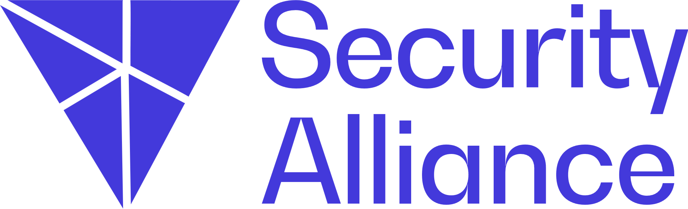
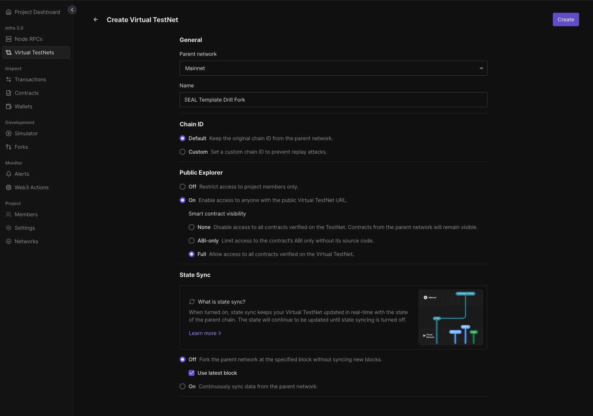
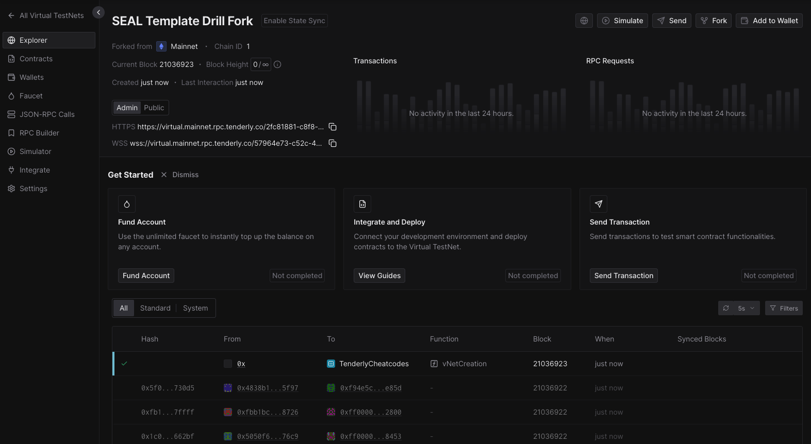
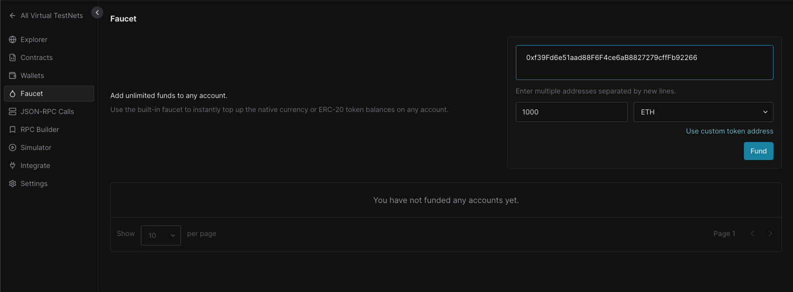
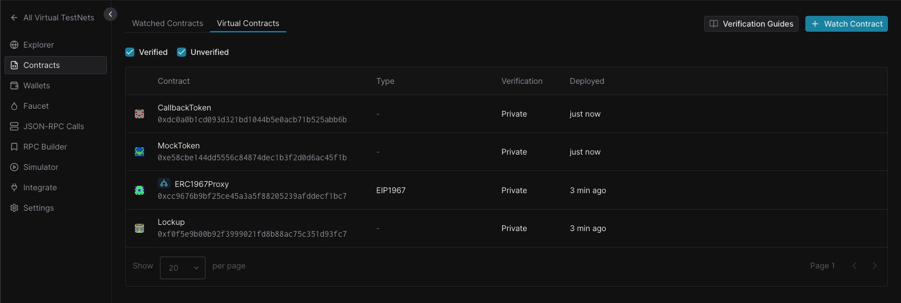
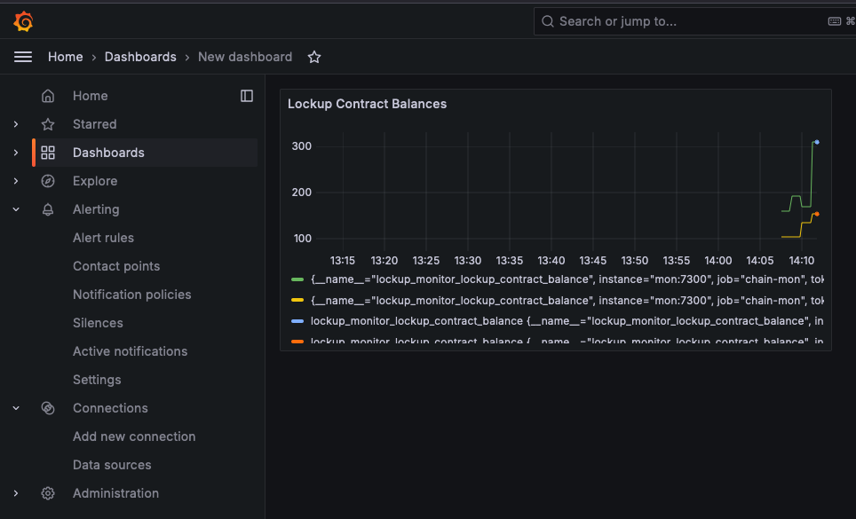
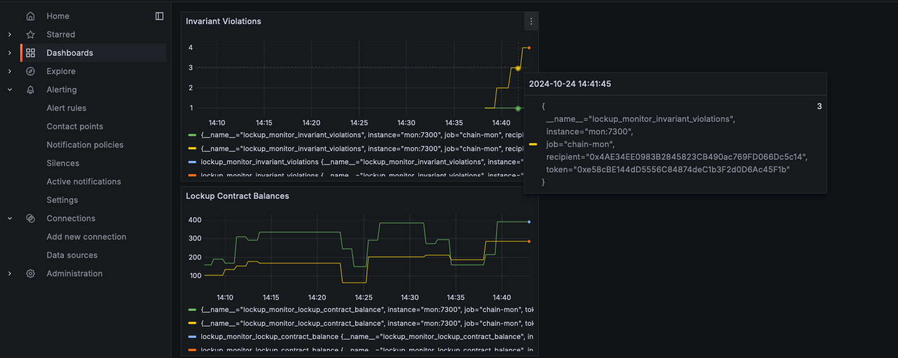
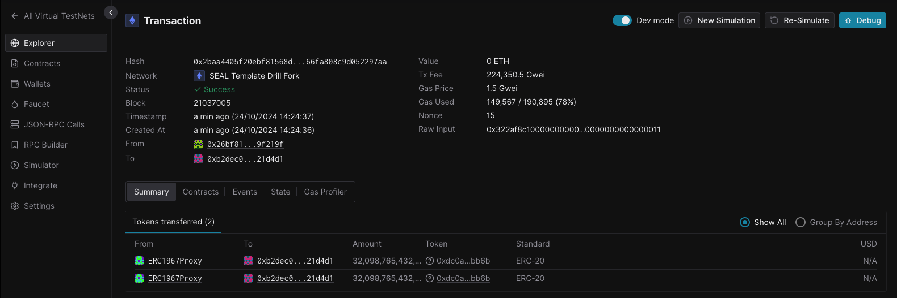
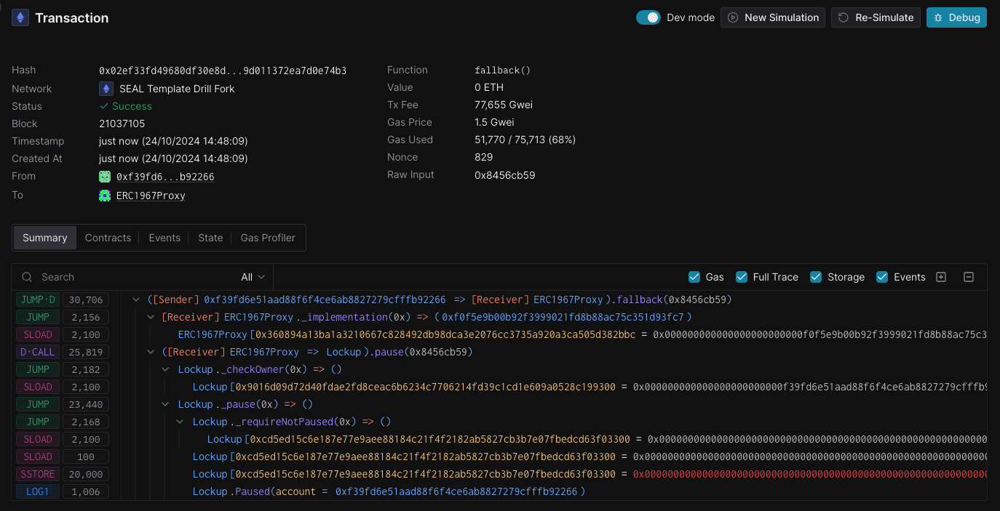
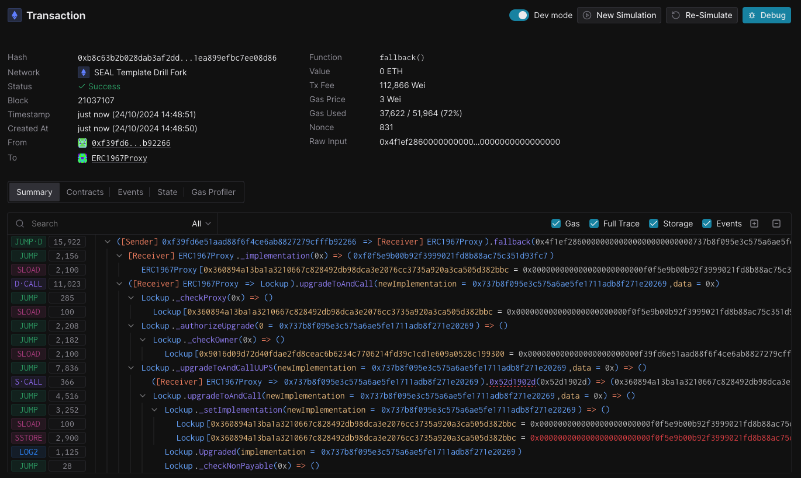

# Security Alliance Wargames Drill Scenario Template



This repository contains the tools that the SEAL Wargames Team uses to coordinate drills with protocol teams. They include:

* A Foundry & Hardhat setup for developing & testing scenarios on a local fork
* Configurations for running a live fork on Tenderly
* A template for a tabletop exercise
* A template typescript bot service (inspired by Optimism)
* A template monitoring bot service with connections to Prometheus, Grafana, and OpsGenie (inspired by Optimism)

[Video Overview of this Repository](https://www.loom.com/share/73ef3e5b9bac446697274441e2c38ccf?sid=ee090249-7593-4630-996e-8b9db32f29d3)

- [Security Alliance Wargames Drill Scenario Template](#security-alliance-wargames-drill-scenario-template)
  - [Planning a Drill](#planning-a-drill)
    - [Phase 1 - Recon](#phase-1---recon)
    - [Phase 2 - Validation \& Tabletop Exercise](#phase-2---validation--tabletop-exercise)
    - [Phase 3 - Live Drill Planning](#phase-3---live-drill-planning)
    - [Phase 4 - Postmortem](#phase-4---postmortem)
  - [Tools](#tools)
    - [Foundry \& Hardhat](#foundry--hardhat)
    - [Live Fork \& Explorer](#live-fork--explorer)
    - [Bot Services](#bot-services)
    - [Monitoring \& Alerting Services](#monitoring--alerting-services)
  - [Other Exercises](#other-exercises)
  - [Getting Started with this Template](#getting-started-with-this-template)
    - [Phase 1 - Recon](#phase-1---recon-1)
    - [Phase 2 - Tabletop Exercise](#phase-2---tabletop-exercise)
    - [Phase 3 - Live Drill Planning](#phase-3---live-drill-planning-1)
      - [1. Validate The Scenario](#1-validate-the-scenario)
      - [2. Validate the Expected Response of the Team](#2-validate-the-expected-response-of-the-team)
      - [3. Implement the Scenario](#3-implement-the-scenario)
        - [3.1 Create a new fork network](#31-create-a-new-fork-network)
        - [3.2 Deploy the Lockup Protocol](#32-deploy-the-lockup-protocol)
        - [3.3 Run the bot service \& exploiter service](#33-run-the-bot-service--exploiter-service)
        - [3.4 Run the monitoring service](#34-run-the-monitoring-service)
      - [4. Run the Drill](#4-run-the-drill)
  - [Adapting this Template](#adapting-this-template)


## Planning a Drill

### Phase 1 - Recon

To plan an effective drill for a protocol, it is important to perform a thorough analysis of the protocol's attack surface, dependencies, governance capabilities, and assumptions. Typically we start by gathering all open source resources about the protocol, including:

* Smart contract architecture
* Deployment & upgrade processes
* Governance processes
* Dependencies on other protocols
* Differences between deployed versions of the protocol, and any planned upcoming changes
* Any known vulnerabilities or past incidents and how the team responds
* Admin functionality & the entities trusted to use it

### Phase 2 - Validation & Tabletop Exercise

Before designing the live drill, it is recommended to perform a tabletop exercise with the protocol team. This is a great way to validate the recon work, and to get a better understanding of the protocol's attack surface. It also helps to build a relationship with the protocol team, which is important for the live drill.

The tabletop exercise should include a few different scenarios to help understand:

* What the protocol team's response process is
* How roles & responsibilities are assigned
* How communication is handled
* The team's understanding of the protocol's configuration & attack surface
* Known issues or upcoming changes

It can also help to ask the team if there are any particular areas of the protocol that they are concerned about, or that they would like to test.

A sample tabletop script is available in [tabletop/template.md](tabletop/template.md).

### Phase 3 - Live Drill Planning

After the tabletop, the tools in this repository can be used to plan a live drill. The drill should be designed to test the protocol's response process, and to validate the recon work. It should also be designed to be as safe as possible, and to minimize the impact on users or risk to the protocol.

Once a scenario has been selected, it can be tested using the Foundry & Hardhat suite using a fork network to validate the conditions of the scenario. The scenario can then be implemented in Silverback, and operated on a live fork on Tenderly.

While it is possible to override contract states and code on fork networks, it is best to keep the scenario as realistic as possible by simulating actions that could realistically be taken by addresses with the appropriate permissions. This helps to validate the protocol's configuration, and to ensure that the protocol team is able to respond to the scenario.

### Phase 4 - Postmortem

After the drill, it is important to perform a postmortem with the protocol team. This should include a discussion of what went well, what could have gone better, and any changes that should be made to the protocol's configuration or response process. It is also a good time to discuss any additional training or resources that the protocol team may need.

## Tools

### Foundry & Hardhat

The test folder contains some utilities for interacting with common protocols. These can be used to test scenarios locally using a fork network. When working with a protocol it is important to write tests to validate the assumptions around the protocol's configuration. Often in writing these tests you will discover potential things to simulate in the drill.

The folder also includes a client for fetching data from TheGraph. This is useful to get network conditions at the time of the fork to simulate behavoir of real addresses.

### Live Fork & Explorer

There are two recommended ways to run the live exercise. You can either set up a fork network on Tenderly using Testnets which comes with an included explorer, or can host a Blockscout explorer connected to a remote anvil node.

### Bot Services

There is an example bot service in the bots folder. This is a typescript bot that can be used to simulate actions by real addresses. It is inspired by the Optimism services from their [Chain-Mon package](https://github.com/ethereum-optimism/optimism/tree/develop/packages/chain-mon). It can be used to simulate actions like deposits, withdrawals, and trades.

### Monitoring & Alerting Services

There is an example monitoring service in the monitoring folder. This is a typescript bot that can be used to monitor the state of the protocol and send alerts to Prometheus, Grafana, and OpsGenie. It is inspired by the Optimism services from their [Chain-Mon package](https://github.com/ethereum-optimism/optimism/tree/develop/packages/chain-mon). It can be used to monitor things like the state of the protocol, the state of the network, and the state of the explorer.


## Other Exercises

In addition to the tabletop and live scenarios, there are other exercises that can be performed to test the protocol's response process. These include:
- Screening governance proposals for malicious intent
- Performing an emergency protocol upgrade

## Getting Started with this Template

This repository contains the tooling for a wargame exercise for a mock protocol. The protocol is a simple token vesting contract with a lockup feature. The goal of the exercise is to simulate an exploit of the lockup feature, and to test the protocol's response process.

### Phase 1 - Recon

Review the Lockup protocol contract in [foundry/contracts/Lockup.sol](foundry/src/Lockup.sol). In the [foundry/test](foundry/test) folder there are some tests that can be used to validate the assumptions around the protocol's configuration. In this case there is an obvious flaw in the lockup feature that can be exploited to steal tokens from the lockup contract if the token has a callback function. During actual wargame exercises the exploit is more subtle and not the result of a simple smart contract bug. For this template assume that the protocol was built without intending to support callback tokens and perhaps the protocol team planned to have a system of whitelisted tokens to prevent this.

### Phase 2 - Tabletop Exercise

Review the template [tabletop/template.md](tabletop/template.md) and prepare a tabletop exercise for the protocol team.

It is recommended to have a mix of standard scenarios and scenarios tailored to the specific protocol. Some standard scenarios include:

* The frontend application of the protocol has been compromised and is collecting malicious signatures from users.
* An external smart contract which is integrated with the protocol has been upgraded by another team in a way that breaks the protocol.
* A new version of the protocol has been deployed with a critical bug.

For the example Lockup Protocol, a scenario could be:

* An attacker exploits a vulnerability in the lockup feature of the protocol to steal tokens from the lockup contract.

These questions and scenarios help to validate the protocol team's understanding of the protocol's configuration, and to identify potential areas of concern. It should also educate the wargame organizer on if the team has an existing incident response process, if they have monitoring for invariants, and if they have a process for handling emergency protocol upgrades.

### Phase 3 - Live Drill Planning

After the tabletop, the organizer should reflect on the answers from the tabletop exercise and plan the live drill. The drill should be designed to test the protocol's response process, and to validate the recon work. It should also be designed to be as safe as possible, and to minimize the impact on users or risk to the protocol.

For the Lockup Protocol we will simulate that a callback token has been integrated into the protocol which reveals a previously unknown re-entrency vulnerability in the lockup feature.

#### 1. Validate The Scenario

In the [foundry/test](foundry/test) folder there are some tests that can be used to validate the assumptions around the scenario. These tests can be run using a fork network to validate the conditions of the scenario. Specifically the [foundry/test/LockupExploit.t.sol](foundry/test/LockupExploit.t.sol) can be used demonstrate that if a smart contract is the recipient of the token lockup for a callback token, it can exploit the re-entrancy vulnerability to steal tokens from the lockup contract.

To validate this for yourself, run the tests with `forge test`.

#### 2. Validate the Expected Response of the Team

Given that the Lockup Protocol contract is upgradeable and pausable, we can expect that the team will pause the protocol and upgrade the contract once they discover the issue.

The contract [foundry/src/LockupV2.sol](foundry/src/LockupV2.sol) is a version of the Lockup contract with the exploit removed.

We can validate that the upgrade will solve the issue in the [foundry/test/LockupIncidentResponse.t.sol](foundry/test/LockupIncidentResponse.t.sol) test.

#### 3. Implement the Scenario

Running the live scenario involves a few different pieces of infrastructure and scripts:

* A new fork network
* Protocol configuration scripts
* A bot service to simulate normal user behavior
* A bot service to simulate the exploit
* A monitoring service to monitor the state of the network

##### 3.1 Create a new fork network

In this example we will be using a fork network on Tenderly. You can also run a fork locally using anvil.



In this case we selected the following options:

* Fork Ethereum Mainnet
* Enable public block explorer
* Disable state sync (state sync is useful if your drill relies on updating values like oracles which can go stale)



On the fork UI you will find the explorer, faucet, admin RPC and public RPC. The admin RPC can be used to spoof sender addresses and use other cheatcodes that are not available on the public RPC.

##### 3.2 Deploy the Lockup Protocol

Populate the `.env` file using the example [.env.example](foundry/.env.example) file.

```
# Use the Admin RPC
TENDERLY_RPC_URL=
# Private key of the deployer address
PRIVATE_KEY=
# Tenderly access token - finds this in the Tenderly dashboard
TENDERLY_ACCESS_TOKEN=
# Tenderly verifier URL - works similar to etherscan verification
TENDERLY_VERIFIER_URL=$TENDERLY_RPC_URL/verify/etherscan
```

Using the Tenderly UI faucet, provide some ETH to the deployer address you created.



Run the deploy script to deploy the Lockup Protocol to the fork.

```
forge script script/DeployLockup.s.sol:Deploy --rpc-url $TENDERLY_RPC_URL --broadcast --verify --verifier-url $TENDERLY_VERIFIER_URL --etherscan-api-key $TENDERLY_ACCESS_TOKEN

forge script script/DeployMockTokens.s.sol:Deploy --rpc-url $TENDERLY_RPC_URL --broadcast --verify --verifier-url $TENDERLY_VERIFIER_URL --etherscan-api-key $TENDERLY_ACCESS_TOKEN
```

The contracts should now be deployed to the fork and verified.



##### 3.3 Run the bot service & exploiter service

In this template, the user bots and exploiter are combined into a single script here [bot/service.ts](services/src/bot/service.ts).

This service creates a set of user accounts and interacts with the Lockup Protocol to simulate normal user behavior.

An exploiter wallet is also created and after a set wait time, the exploiter will deploy a contract to exploit the re-entrency bug and steal tokens from the lockup contract.

Update the `.env` file with the private key of the exploiter wallet.

```
###############################################################################
#                               ↓ bot ↓                               #
###############################################################################

# Tenderly RPC URL
BOT__RPC_PROVIDER=
# Use any mnemonic. The accounts will be funded by the faucet
BOT__MNEMONIC=
# Set the faucet key to the same as contract deployer
BOT__FAUCET_KEY=
BOT__PORT=7401

# Get addresses from Tenderly contracts dashboard
BOT__MOCK_TOKEN_ADDRESS=
BOT__CALLBACK_TOKEN_ADDRESS=
BOT__LOCKUP_PROXY_ADDRESS=

# Use the start block of the fork
BOT__LOCKUP_INDEXING_START_BLOCK=

# Any number between 3-10 is reasonable
BOT__NUM_BOTS=3

# Create a private key for the exploiter. It will be funded by the faucet automatically
BOT__EXPLOITER_PRIVATE_KEY=
# Wait time before exploit begins in ms
BOT__EXPLOIT_WAIT_TIME_MS=300000

###############################################################################
#                               ↓ mon ↓                               #
###############################################################################

# Get addresses from Tenderly contracts dashboard
LOCKUP_MONITOR__LOCKUP_PROXY_ADDRESS=
LOCKUP_MONITOR__RPC_PROVIDER=
# Use the start block of the fork
LOCKUP_MONITOR__LOCKUP_INDEXING_START_BLOCK=
```

Once the above is populated, run the bot service with `pnpm run dev:bot`.

##### 3.4 Run the monitoring service

In this template, the monitoring service is available here [mon/service.ts](services/src/mon/service.ts).

This service collects metrics on token balances of the Lockup Protocol, claim events, and checks for an invariant that the total amount of tokens received by a lockup user address is not more than the total amount of tokens that were locked up for them.

The metrics are exposed in a way that can be collected by a Prometheus server and served by a Grafana instance.

When debugging the monitoring service it can be run locally with `pnpm run dev:mon`. However to run it with Prometheus and Grafana it can be started with docker compose using the file here [compose.yaml](monitoring/compose.yaml).

Run this with `docker compose -f compose.yaml up --build -d` in the `monitoring` folder.

Grafana will be available on port 3000 and Prometheus on port 9090 on localhost.

The default login is `admin` with password `grafana`.

In a live drill this can be hosted easily on a [Digital Ocean Docker Droplet](https://www.digitalocean.com/community/tutorials/how-to-use-the-docker-1-click-install-on-digitalocean)



In this dashboard we have created a panel to monitor the balance of each token in the Lockup contract.

#### 4. Run the Drill

Prior to running the drill, the protocol team should be notified of the upcoming drill and given a chance to prepare. This includes sharing all relevant links and instructions for them to treat the drill as if it were a real incident.

Do not share the exact incident in advance. The team should discover the exploit themselves.

It can be helpful to prepare an expected order of events for the organizer and the team to follow. For example.

**8:30 AM** - Fresh network fork is configured and bots are running

**9:00 AM** - Drill begins - send instructions and links to the team

**9:10 AM** - Exploit begins

**9:15 AM** - Exploit is discovered

In the image below we can see an invariant violation was discovered meaning the contract was exploited.



**9:20 AM** - Warroom is created

**9:25 AM** - Team evaluates the incident and assesses damage

**9:30 AM** - Team triages the incident



In this screenshot we can see multiple token transfer events from the lockup contract to the exploiter contract.

**9:45 AM** - Team discusses the incident and plans the fix

**10:00 AM** - Fix is deployed

To test the pause and upgrade, use the following scripts in the foundry repo.

```
forge script script/LockupPause.s.sol:LockupPause --rpc-url $TENDERLY_RPC_URL --broadcast
forge script script/LockupUpgrade.s.sol:LockupUpgrade --rpc-url $TENDERLY_RPC_URL --broadcast
```

Here we can see the trace of the pause transaction


And the trace of the upgrade transaction


After this we should see no new invariant violations on the dashboard. And once the protocol is unpaused we should see lockups behaving normally.

**10:15 AM** - Drill ends

**10:30 AM** - Postmortem is conducted

**10:45 AM** - Drill is concluded

## Adapting this Template

This template contains all of the core components needed to run a wargame exercise. However, it is possible that the protocol team may have specific infrastructure that needs to be set up on the fork, and the scenario may need to be adapted to fit the protocol's specific attack surface.

It is recommended to fork this repository, first validate the scenario in foundry, then adapt the bots & monitoring services to fit the protocol's specific needs.
# drill-template-multichain
